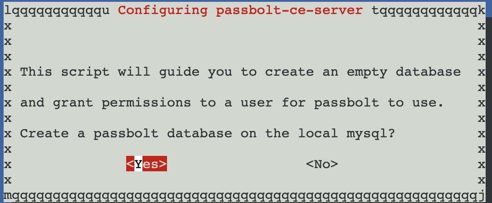

## Q.1.1.1 

## Q.1.1.2

D'abord un clic droit au niveau du nom du domaine ensuite **new** et **organizational unit**.On la nommera **DesactivatedUsers**.L'ou a bien été créée.Ensuite clique droit su rKelly.Rhameur et sur Disable Account

## Q.1.1.3

