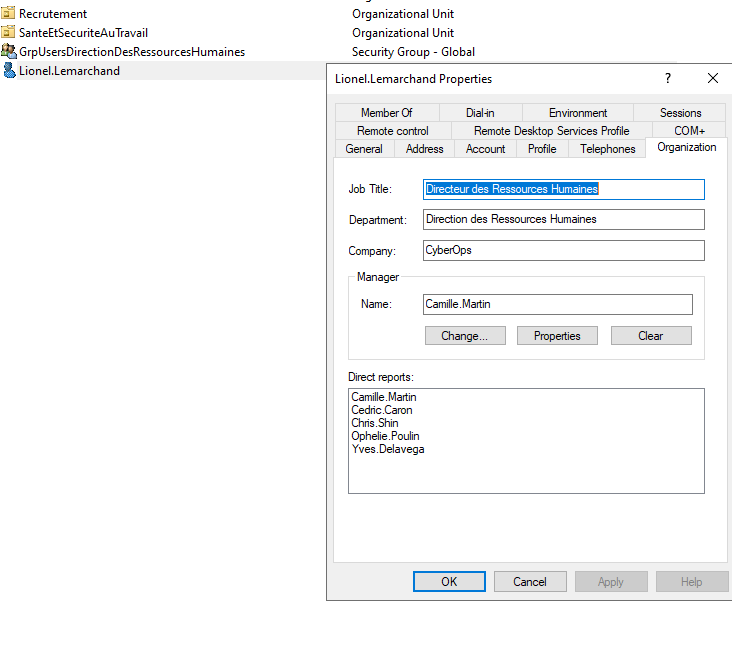
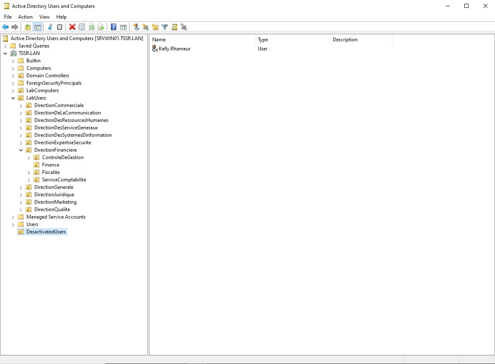
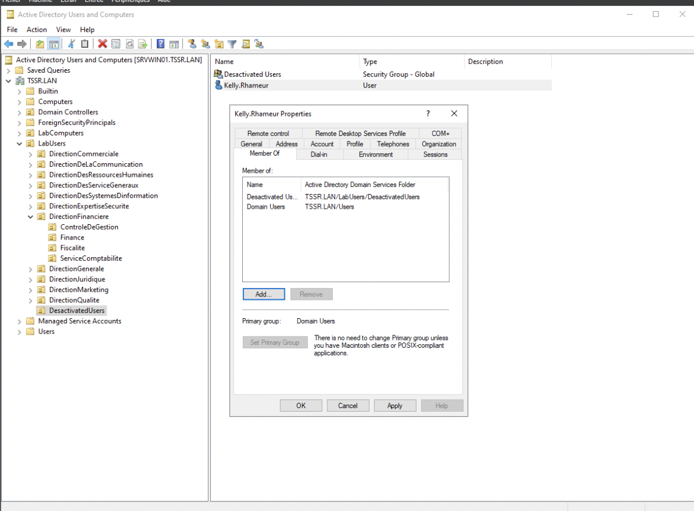
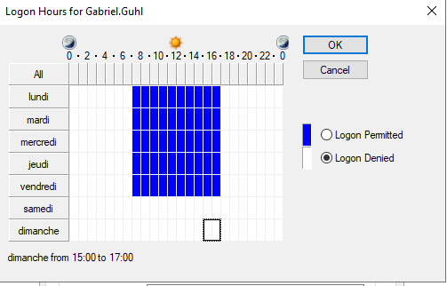
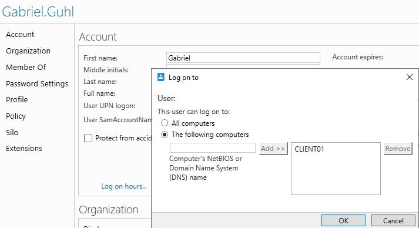
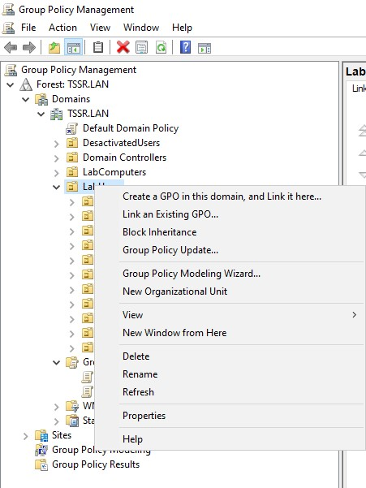
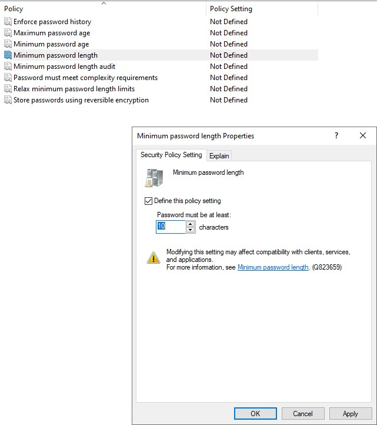

## Q.1.1.1 

## Q.1.1.2

D'abord un clic droit au niveau du nom du domaine ensuite **new** et **organizational unit**.On la nommera **DesactivatedUsers**.L'ou a bien été créée.Ensuite clique droit su rKelly.Rhameur et sur Disable Account

## Q.1.1.3

On fera un clic droit sur kelly,on sélectionne son ancien groupe puis on fait `remove`

## 1.2.1

Gabriel Guhl est dans la sous-OU Finance.On fait un clic-droit puis `Properties`/`Account`/`Logon Hours`.

## 1.2.2

Clique droit puis `properties`/`account`/`log on to` et on tape `CLIENT01`

## 1.2.3

On se rend dans Windows Server Manager,puis `Tools` puis `Group Policy Management`,clic-droit sur l'OU LabUsers, puis `Create a GPO in this domain, and link it here....`

On nomme la GPO, on fait unclic droit puis `Edit`/`Computer Configuration`/`Policies`/`Windows Settings`/`Security Settings`/`Password Policy`. On peut donc désormais  appliquer les règles de durcissement de mot de passe que l'on souhaite.

## 1.3.1

On va d'abord partager les dossiers DossiersIndividuels et DossiersCommuns afin d'obtenir le chemin d'accès (Pour F : \ScrvWin01\ et pour E : \ScrvWin01) que nous utiliserons pour configurer le mappage des GPO
