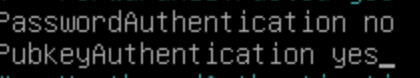

## Q.2.1.1
Il suffit de faire un `adduser lamine` dans mon cas.

## Q.2.1.2
Je propose de l'ajouter au groupe au groupe sudo avce un `usermod -aG usermod lamine`

## Q.2.2.1

## 2.2.3

Il suffit juste de faire `PubkeyAuthentication yes` et `PasswordAuthentication no` 

## Q.2.4.1
Bareos-dir gère la configuration de l'ensemble du système.Bareos-sd gère le stocakge physique des sauvegardes.Bareos-fd est insatllé sur une machine à sauvegarder,il doit lire les fichiers à sauvegarder et les envoyer a storage daemon.

